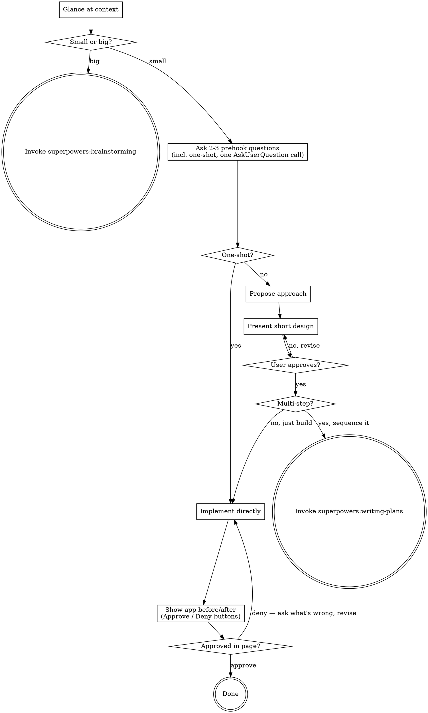

# Mini Brainstorming

Turn a small idea into a small, agreed-upon design — fast — through a couple of
sharp questions instead of a long dialogue. This is the **express lane** version
of `superpowers:brainstorming`: same destination (a design the user approved
before any code), far fewer stops.

The bet behind this skill: even small changes carry hidden assumptions (where it
lives, what it touches, what "done" means), and a 60-second alignment pass is
cheaper than redoing work. But a small change does NOT deserve the full
one-question-at-a-time interview — that's overkill that annoys the user. So we
batch 2–3 questions, propose, confirm, and go.

<HARD-GATE>
Do NOT write code, scaffold, or invoke any implementation skill until EITHER the
user has approved a short design, OR the user has explicitly told you (via the
one-shot prehook question below) that it's clear enough to just implement. The
point isn't ceremony — it's that the user, not you, decides whether a change is
obvious enough to skip the design pass.
</HARD-GATE>

<HARD-GATE>
The moment the user picks "one-shot," questioning is OVER for the rest of the
task. No follow-up questions, no "just to confirm," no AskUserQuestion calls,
no design pass — go straight to building, resolving every open detail yourself
with the best-case reading of the context you already have. The SOLE exception:
an action that is destructive or irreversible (deleting data, dropping a table,
force-pushing, publishing something that can't be unpublished) — confirm that
one action and nothing else.
</HARD-GATE>

## First: is this actually small?

Before anything else, judge the scope yourself from the request and a quick look
at the code, then **say your call out loud in one line** and proceed unless the
user objects. You don't ask permission to continue on something small — you just
note it ("This looks like a small, localized change — I'll do a quick design
pass") and move on. The user can always say "actually this is bigger than it
looks."

**Route to the full skill when you see "big" signals.** If the work touches
multiple independent subsystems, introduces new architecture or a new data
model, has open-ended/ambiguous requirements that need real exploration, or
would sensibly be decomposed into sub-projects — stop and say so, then invoke
`superpowers:brainstorming`. Mini-brainstorming is the wrong tool and the full
skill exists for exactly this.

**Stay here for "small" signals.** A localized add-on, one clear unit of
behavior, a change that fits existing patterns and touches a handful of files,
where you can already picture the implementation. That's the sweet spot.

When it's genuinely borderline, make one of your prehook questions the scope
question and let the user decide.

## Checklist

Create a task for each item and complete them in order:

1. **Glance at context** — the relevant file(s), nearby patterns, recent commits. Light, not a deep dive.
2. **Judge & state scope** — small (continue) or big (invoke `superpowers:brainstorming` and stop).
3. **Ask 2–3 prehook questions** — batched in a single `AskUserQuestion` call, and one of them MUST be the one-shot question (is this clear enough to just implement?).
4. **Branch on the one-shot answer:**
   - **One-shot → implement directly. From this point on, questions are OFF (HARD GATE).** The
     user has explicitly said it's clear, so do not ask anything further — not the
     other batched questions, not a follow-up, not "just to confirm." Skip the
     design pass and build it, resolving every open detail by **assuming the
     best-case interpretation from the context you already have** — the
     conversation, the codebase, the user's stated intent. Asking again is exactly
     the friction they opted out of.
   - **Not one-shot → continue to steps 5–7.**
5. **Propose the approach** — your recommended approach in a sentence or two; offer an alternative only if there's a real fork.
6. **Present the short design & get approval** — a few sentences, scaled to the change.
7. **Build it — or plan first only if it's multi-step.** With the design approved, the gate is satisfied: for most small changes, implement directly — the approved design *is* the agreed record. Hand off to `superpowers:writing-plans` first only when the change, though small, has several ordered steps that genuinely benefit from being sequenced on paper.
8. **Show the before/after and wait for the verdict** — for user-visible application changes, show application screenshots before vs. after, not code. Capture the relevant app state before editing, capture the same state after verification, then run `scripts/generate_visual_before_after.py` with those screenshots. Use the code-diff page only for non-visual changes.

## Process Flow



**Once the design is approved, the gate is open.** For most small changes the
next step is simply to build it — the approved design is the agreed record the
gate exists to produce. Reach for `superpowers:writing-plans` only when the change
is multi-step enough that a written sequence actually helps. Either way, don't
start editing before the design is approved, and don't reach for a *different*
implementation skill.

## The Prehook Questions

This is what makes mini-brainstorming *mini*: instead of a back-and-forth
interview, ask **2–3 questions at once** with the `AskUserQuestion` tool, so the
user answers everything in a single pass. Minimum 2 (one question isn't a design
pass), maximum 3 (more than that and you should be using the full skill).

**One question is mandatory: the one-shot question.** Always ask whether the
user considers this change one-shot — clear and contained enough that you should
just implement it — or whether they want a quick design pass first. Their answer
controls the branch: one-shot means you skip straight to implementing; not
one-shot means you propose, present a short design, and get approval before
building (handing off to writing-plans first only if the change is multi-step).
Phrase it plainly, e.g. *"Is this one-shot — should I just implement it — or do
you want a quick design pass first?"*

Then pick **1–2 more** that actually matter for *this* change, for 2–3 total.
Skip any whose answer is already unambiguous from the code or the user's request
— never ask what you can already see. Good candidates, roughly in priority order:

- **Intent / exact behavior** — what should it do, precisely? The desired
  behavior is where small asks hide big ambiguity ("add a logout button" — where,
  and does it clear the session or just redirect?).
- **Placement / integration** — where does it live and what does it hook into?
  Offer the concrete spots you found in step 1 as options.
- **Scope / done definition** — what's in and what's explicitly out? Keeps a
  "small" change from quietly growing.
- **Scope check (borderline only)** — "handle this as a quick change, or do the
  full brainstorming pass?" — when you genuinely can't tell.

Ask the one-shot question and your 1–2 others together in a single
`AskUserQuestion` call. Prefer concrete multiple-choice options grounded in what
you saw in the code over open-ended prompts — they're faster to answer and
surface that you've already looked. Lead each option with your recommendation
where you have one.

## The One-Shot Path

If the user answers that the change is one-shot, take them at their word: skip
the propose/design/approve steps, **ask no further questions, and implement it
directly.** One-shot means *one shot from here onwards* — the moment they pick it,
the questioning phase is over. This is the whole reason the question exists: the
user has just told you the change is clear, so coming back with more clarifying
questions is exactly the friction they opted out of. For every detail that's still
open (a label, a placement, a default value, which fields, error handling),
**assume the best-case scenario from the context you already have** — the
conversation, the existing code and its conventions, and the user's stated intent
— pick the reading a thoughtful teammate would, make the call, build it, and
mention what you chose in passing. The bar for proceeding is "can I make a
reasonable assumption?", not "am I certain?" — and the answer is almost always
yes.

Two caveats worth respecting:

- The "no more questions" rule is a HARD GATE and it is absolute for anything
  you can resolve with a judgment call — which is everything short of
  destruction. If implementation reveals a genuinely irreversible fork (a
  destructive migration, deleting user data, an outward-facing action that
  can't be undone), confirm that ONE action and nothing else. Every other
  surprise — ripples into other code, a consequential-but-reversible tradeoff,
  a detail the user might care about — you resolve yourself with the best-case
  reading and note in your report. If mid-build you feel the urge to ask,
  the answer is: make the call and keep building.
- One-shot means skip the *design pass*, not skip *verification*. Still make the
  change carefully and check it does what was asked — and still finish with the
  app-level before/after review when the change is visible (see "After Building"
  below).

If the user answers that it's not one-shot, continue to the propose/design/approve
flow below.

## Propose, Present, Approve

**Propose the approach.** State your recommended approach in a sentence or two
and why. Only lay out an alternative if there's a genuine fork worth the user's
attention — for most small changes there's one obvious path, and pretending
otherwise just adds noise.

**Present the short design.** Scale it to the change: often two or three
sentences covering what you'll add/modify, where, and how it behaves. Name the
specific files or functions you'll touch so the user can sanity-check the blast
radius. If the change has any subtlety (error handling, an edge case, a
migration), call it out — that one sentence is usually the whole point of doing a
design pass at all.

**Get approval.** Ask whether it looks right. If the user pushes back, revise and
re-present — don't proceed on a maybe.

## After Approval

The approved short design already *is* the explicit, agreed record the gate
exists to produce — so for most small changes, just build it. Re-deriving that
design into a separate plan document is the kind of ceremony this skill is meant
to strip out: `superpowers:writing-plans` is built for multi-step work, and a
one-helper or one-button change isn't that.

So branch on the actual shape of the work:

- **Single, self-contained change** (one unit of behavior, a handful of edits you
  can already picture) → **implement directly.** The design you just got approved
  is enough; a plan would only restate it.
- **Small but genuinely multi-step** (several ordered edits, a migration paired
  with its callers, touch-points that have to land in sequence) → hand off to
  `superpowers:writing-plans` first. Here a written sequence earns its keep by
  keeping the steps straight, and the resulting short plan is correct *because*
  the work has real ordering — not as a formality.

You usually don't need a separate committed spec document the way the full
brainstorming skill produces one. If the user wants the design written down, drop
it into the plan that writing-plans creates (when you make one) rather than
starting a parallel spec file.

## After Building: Show the Before/After

Once the change is implemented — on **either** branch, one-shot included — give
the user a visual record of what actually changed. For UI, website, app copy,
layout, styling, or any other user-visible change, the review must show the
application itself, not a source-code diff.

### Visual App Review

For user-visible changes:

1. Before editing, get the app into the relevant state and capture screenshot(s)
   of the route/component the user will care about. Use desktop and mobile when
   responsive behavior matters.
2. Make the change and run the relevant verification.
3. Capture matching after screenshot(s): same route, same viewport, same test
   data when practical.
4. Run the visual review script from the repo root:

```bash
python3 <skill-dir>/scripts/generate_visual_before_after.py \
  --pair /path/to/before.png /path/to/after.png "Desktop home page"
```

Pass multiple `--pair BEFORE AFTER LABEL` groups for multiple screens or
viewports. The script serves a page with the app screenshots side-by-side and
**Approve / Deny** buttons, then blocks until the user clicks:

- exit `0` / last line `APPROVED` → the user signed off; wrap up and report.
- exit `1` / last line `DENIED` → the user rejected the change; ask what's
  wrong in the conversation, revise, and show a fresh visual before/after.
- exit `2` / last line `TIMEOUT` (default 570s) → no click arrived; fall back
  to asking for approval directly in the conversation instead.

If the environment cannot capture screenshots, explain that limitation and show
the best available app-level evidence: running URL, rendered screenshot from any
available browser tool, or a concise manual verification checklist. Do not
substitute a code diff for a visual app change unless no visual capture path is
available.

### Code Diff Fallback

For non-visual changes only — a CLI behavior, config flag, helper, API-only
change, test-only edit, or other work where an app screenshot would not show the
result — the review page must still lead with a **human explanation, not raw
code**: the person approving may not read code, and even for those who do, the
question is "did the behavior change the way I asked?", which a diff doesn't
answer by itself.

First write a summary JSON to a temp path. The page is **visual first**: each
change shows a Before ➜ After pair of small mermaid diagrams, with one-line
plain-language captions beneath. Keep everything behavior-level and jargon-free
(what the software *does*, not which lines moved). Only you have the
conversation context to explain the *why*, which is exactly what the script
cannot derive from the diff:

```json
{"title": "short title of the change",
 "overview": "1–2 sentence plain-language summary of the whole change",
 "diagram": "optional: one mermaid flowchart of the whole change (omit if the per-file ones cover it)",
 "changes": [{"file": "path/to/file",
              "what": "what changed in this file, in plain words",
              "why": "why it was needed (from the conversation context)",
              "before": "one-line caption: how it behaved before",
              "after": "one-line caption: how it behaves now",
              "before_diagram": "flowchart TD\n  q[user asks] --> c[crash 💥]",
              "after_diagram": "flowchart TD\n  q[user asks] --> ok[works ✅]"}]}
```

Diagram guidance: `flowchart TD` (or `LR` for short chains), 2–5 nodes, node
labels in plain words a non-programmer gets ("user clicks Run", "training
crashes"), and make the before/after pair *differ visibly* — the reviewer
should spot the change by shape alone, before reading a single label. An emoji
on the changed node helps. Skip a diagram only when a change is too trivial to
draw (a renamed flag); the caption then stands alone.

Then run the code review script from the repo root:

```bash
python3 <skill-dir>/scripts/generate_before_after.py --summary /path/to/summary.json
```

It diffs the working tree against `HEAD` (untracked files included as added)
and renders one card per file: the What/Why and a Before ➜ After panel pair
with the rendered diagrams (mermaid via CDN; degrades to the caption text
offline), the raw code diff collapsed behind a "Show code" toggle for anyone
who wants to verify the details. It serves the page on localhost, opens
the browser, and **blocks until the user clicks Approve or Deny** in the page. The
click is what resumes you: run the script in the **foreground** with a generous
timeout (e.g. 600000 ms) and read the result when the command returns —

- exit `0` / last line `APPROVED` → the user signed off; wrap up and report.
- exit `1` / last line `DENIED` → the user rejected the change; ask what's
  wrong in the conversation, revise, and show a fresh before/after.
- exit `2` / last line `TIMEOUT` (default 570s) → no click arrived; fall back
  to asking for approval directly in the conversation instead.

If you already committed the change, pass `--base HEAD~1`; to scope to specific
files, list them as trailing arguments. In headless environments (no browser),
use `--static --out <path>` to just write the page — buttons are omitted — tell
the user the path and ask for approval in the conversation.

This closes the loop the skill opened: the design said what *would* change, the
review shows what *did*, and the Approve click is the user's sign-off on it.
For visual work, the user should approve what the application looks like, not
what the code diff looks like.

## Key Principles

- **Batch, don't interview** — 2–3 questions in one pass is the whole point; if you find yourself wanting a fourth round, you're in full-brainstorming territory.
- **State your scope call, don't ask for it** — proceed on "small" unless the user objects; only ask when it's truly borderline.
- **Let the user set the depth** — the one-shot question hands them the call: just-implement vs. design-pass. When they pick one-shot, questions are off: implement directly and ask **nothing further**, assuming the best-case reading of any open detail from the context you already have; only back out to a design pass if implementation reveals a genuine, consequential fork.
- **Ground questions in the code** — options built from real files beat abstract prompts and prove you looked.
- **YAGNI** — keep the change as small as the user actually asked for; resist scope creep into "while we're here…".
- **Approval before code** — the gate is non-negotiable even for one-liners; the design can be tiny, but it must be agreed. The approved design is the artifact the gate needs; a separate written plan is optional, warranted only when the change is multi-step.
- **Know when to escalate** — handing off to `superpowers:brainstorming` on a big request is a success, not a failure.
